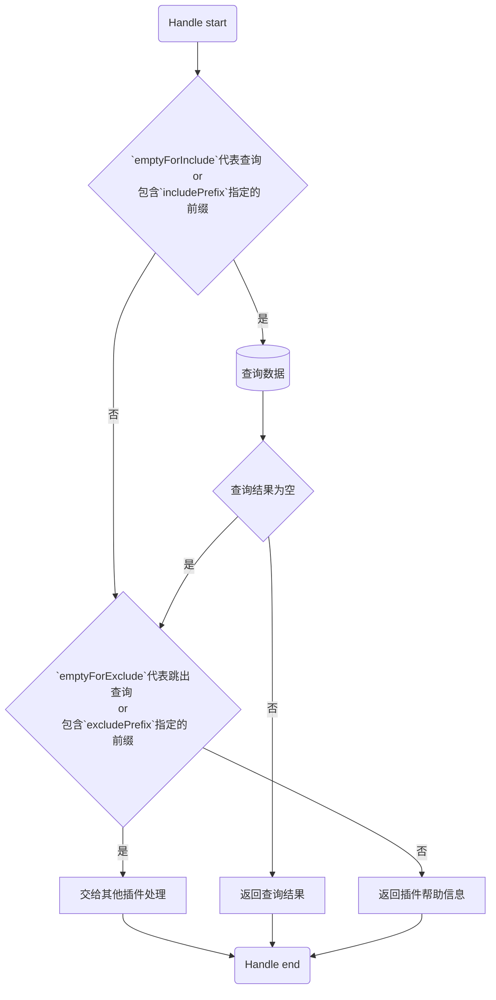

# MysqlKeywords

>**[chatgpt-on-wechat](https://github.com/zhayujie/chatgpt-on-wechat) **
>
>基于大模型搭建的微信聊天机器人，同时支持微信、企业微信、公众号、飞书接入，可选择GPT3.5/GPT4.0/Claude/文心一言/讯飞星火/通义千问/Gemini/LinkAI，能处理文本、语音和图片，访问操作系统和互联网，支持基于自有知识库进行定制企业智能客服。

本仓库是为 [chatgpt-on-wechat](https://github.com/zhayujie/chatgpt-on-wechat) 开源项目编写的一个[小插件](https://github.com/jeady5/mysqlKeywords)。

该插件用于根据关键词查询Mysql数据库，并返回查询信息.

并提供专门的指令管理关键词信息，如关键词的增删查改、关键词的状态管理等。

## 一、你必须做的

安装并保证服务器的 `mysql` 服务已经正常启动。  

## 二、python依赖
* pymysql==1.1.0   

```shell
pip install pymysql
```

## 三、执行逻辑



## 四、功能介绍

* ***key**: 关键词*   

* ***value**, **newValue**: 关键词的回复*  
* ***state**: 激活状态*  

| 控制语法                        | 语法说明                                   |
| ------------------------------- | ------------------------------------------ |
| key                             | 查询全部匹配的回复，如\*key*               |
| 关键词列表(可配置)              | 查询全部激活的关键词                       |
| 我想要key                       | 上传新需求                                 |
| 需求列表                        | 查询全部已提交的需求                       |
| $管理命令(可配置)               | 查询全部已知指令                           |
| $add key value                  | 新增关键词回复                             |
| $remove key                     | 删除关键词回复                             |
| $remove key*                    | 删除多个匹配项，如key-a, key-b             |
| $remove key value               | 删除指定键值的回复                         |
| $update key newVaue             | 更新指定键的值                             |
| $enable key                     | 启用指定回复                               |
| $disable key                    | 禁用指定回复                               |
| $private key                   | 不显示在关键词列表，但响应关键词回复        |
| $启用全部回复                   | 启用该插件的回复功能                       |
| $禁用全部回复                   | 禁用该插件的回复功能                       |
| $config [dbName [user passwd]]] | 修改mysql的配置项；默认 db_gpt root 123456 |
| $config tbName                  | 设置关键词从哪个表查询； 默认tb_keywords   |
|                                 |                                            |
|                                 |                                            |
|                                 |                                            |

## 五、配置示例

​	*注：拷贝时记得删除注释*

1. 简单配置

```json
{
  "mysql": { # 数据库信息，不做解释
    "host": "localhost", 
    "user": "root",
    "passwd": "123456",
    "dbName": "db_gpt",
    "tbName": "tb_keywords",
    "port": 3306
  }
}
```

2. 全部配置

```json
{
  "mysql": { // 数据库信息，不做解释
    "host": "localhost",
    "user": "root",
    "passwd": "123456",
    "dbName": "db_gpt",
    "tbName": "tb_keywords",
    "port": 3306
  },
  "includePrefix": "",# 匹配时进行关键词查询，否则执行`excludePrefix`判断；为空时按照`emptyForInclude`执行
  "excludePrefix": "",# 匹配时交给下个组件处理，否则返回状态/帮助信息；为空时按照`emptyForExclude`执行
  "emptyForInclude": true,# 当`includePrefix`为空时，true进行关键词查询；false跳过查询
  "emptyForExclude": true,# 当`excludePrefix`为空时，true交给其他插件；false回复帮助信息
  "cmd": {
    "keyList": "关键词列表", # 回复用户所有的关键词列表
    "admin": "$管理命令", # 回复全部的命令
    "enableReply": "$启用全部回复", # 启用全部关键词查询回复
    "disableReply": "$禁用全部回复", # 禁用全部关键词查询回复
    "configMysql": "$config" # 配置mysql数据库;$config tbName / $config user passwd / $config dbName user passwd
  }
}
```

## 六、使用说明

​	*ps：需要首先启动mysql服务*

* 方法1. 使用 chatgpt-on-wechat 自带的 [插件管理](https://github.com/zhayujie/chatgpt-on-wechat/tree/master/plugins#%E6%8F%92%E4%BB%B6%E5%AE%89%E8%A3%85%E6%96%B9%E6%B3%95) 功能  

  *概要：项目启动后，发送下面的插件管理指令安装本插件*  

  ```shell
  #installp https://github.com/jeady5/mysqlKeywords.git
  
  #scanp
  
  // ps: 记得手动修改配置文件中`mysql`的用户名及密码，默认为user:root; pwd:123456
  ```

* 方法2. 使用git手动安装插件  

  2.  在 `chatgpt-on-wechat/plugins` 目录下打开终端。  
  2.   `git clone https://github.com/jeady5/mysqlKeywords.git mysqlKeywords`  
  2.  进入 `mysqlKeywords` 插件目录，安装依赖 `pip install -r requirements.txt`  
  2.  复制`config.json.template` 并改名为 `config.json`  
  2.  至少把 `mysql` 配置项中的用户名密码调对  
  2. 重启 `chatgpt-on-wechat` 项目  
  2.  发送 `$管理命令` 测试本插件是否正常回复管理命令列表  


## 七、热门配置

1. (**默认配置**) 优先进行关键词查询，查询为空时交给下一个插件处理  

   ```json
   {
     "includePrefix": "",
     "excludePrefix": "",
     "emptyForInclude": true,
     "emptyForExclude": true,
   }
   ```

2. 进行关键词查询，查询为空时回复空，永远不交给下一插件  

   ```json
   {
     "includePrefix": "",
     "excludePrefix": "",
     "emptyForInclude": true,
     "emptyForExclude": false,
   }
   ```

3. 输入 `key +关键词` 时匹配关键词，查询为空时交给下一个插件  

   ```json
   {  
     "includePrefix": "key ",
     "excludePrefix": "",
     "emptyForInclude": false,
     "emptyForExclude": true,
   }
   ```

4. 优先查询关键词，查询为空时，匹配 `bot +query` 才会交给下一个插件，否则回复空  

   ```json
   {  
     "includePrefix": "",
     "excludePrefix": "bot ",
     "emptyForInclude": true,
     "emptyForExclude": false,
   }
   ```

5.  匹配 `key +关键词` 时查询关键词，匹配 `bot +query` 时交给下一个插件  

   ```json
   {  
     "includePrefix": "key ",
     "excludePrefix": "bot ",
     "emptyForInclude": false,
     "emptyForExclude": false,
   }
   ```
